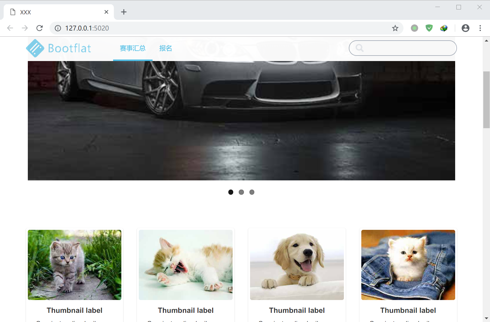

# Raizerugu - 幻想岛上的 Web 服务器

## 项目说明

Raizerugu 是以计算机网络课程设计为目的，使用 Java 语言实现的简易 Web 服务器，拥有正确相应 HTTP 请求并返回 HTML，CSS，JS 和图片对象、支持多用户同时访问的多线程处理机制、对象缓存池、错误请求返回页面、条件 GET 等功能。

## 使用方式

与其它多数 Web 服务器一样，Raizerugu 以位于服务器的文件系统为基础，通过映射文件夹下的 HTML、CSS、JS 和其他对象至 URL 目录进行内容提供。

Raizerugu 使用 Java 语言实现，提供了预编译版本。最新版本号为 0.2.1。

测试方法为：在安装 Java Runtime 后，进入项目的 `target\`目录，在命令提示符中输入

    java -jar raizerugu-0.2.1.jar

命令，此时返回如下结果：

此时程序运行成功，但服务器并没有启动，原因在于必须指定服务器根目录的位置。

Raizerugu 提供了测试文件夹，可通过

    java -jar raizerugu-0.2.1.jar -r ..\test

命令指定服务器根目录为项目的 `test\`目录。此时服务器运行成功。

打开浏览器，输入`http://127.0.0.1:5020/`，即可看到服务器返回了正常的内容。

此时服务器端显示了浏览器的访问日志。

当试图访问一个不存在的对象时，服务器返回 404 Not Found：

当多次访问相同的对象时，服务器根据浏览器发送的 IF-MODIFIED-SINCE 报头检查对象是否更新，如未更新，则返回 304 Not Modified：

## 命令行参数

| 参数 | 功能                                                                                                                              |
| ---- | --------------------------------------------------------------------------------------------------------------------------------- |
| -r   | 指定服务器的根目录                                                                                                                |
| -h   | 指定服务器绑定的 IP。 如果绑定为 127.0.0.1，则只能通过本地回环访问； 如果绑定为 0.0.0.0，则可通过本机被分配的任意 IP 访问。 |
| -p   | 指定服务器绑定的端口                                                                                                              |

## 项目结构

由于 Raizerugu 的功能较为简单，因此项目结构不甚复杂。

`Main.java` 包含程序的入口函数。通过构造新的 `Server` 实例，解析命令行参数后传入 `Configuration` 实例配置，最后调用 `server.start()`启用服务器。

`Server.java` 包含 `Server` 类的实现，其中 `start()`函数通过 `socket.accept()`监听 TCP 连接，对新的 TCP 连接将其分发给新的 `ServiceThread` 线程处理，从而实现了多用户同时访问。

`ServiceThread.java` 包含对连接的读取、处理、响应的过程。其首先通过 `HTTPRequest.parseFrom()`函数解析 HTTP 请求的内容，并将生成的 `HTTPRequest` 对象传入 `makeResponse()`中进行 HTTP 响应的构造，最终将构造的内容通过 `getBytes()`转换为字节流，从 socket 连接传回客户端。之后关闭 socket 连接，结束本次交互。

## 其他说明

Raizerugu 使用 Eclipse for Java EE 编码，可以通过 Eclipse for Java EE 打开项目所在的目录，查看源代码。

如需编译，可通过右键项目文件夹，选择 Run as -> Maven build，进行编译。

